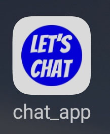
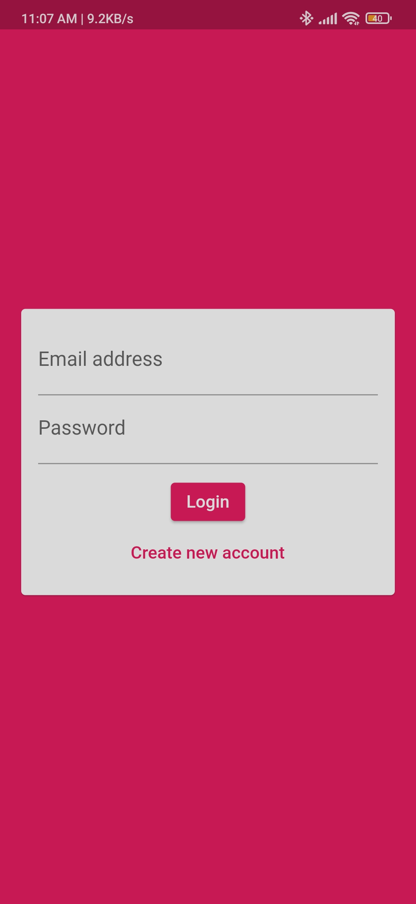
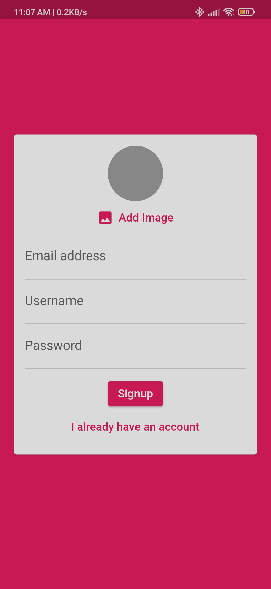
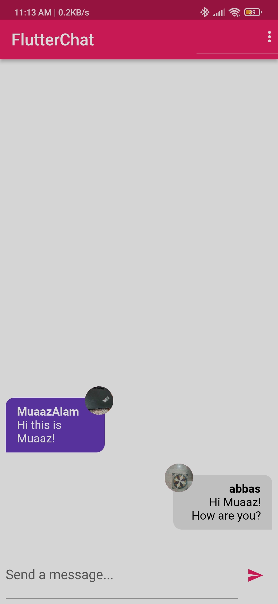

# Chat App

You can also download my app's apk using this [link.](https://drive.google.com/file/d/1KqV06lrBoKyfro7nceyW3GI-duYUDikz/view?usp=sharing)

This is a chat application built using Flutter and Dart. The app provides a platform for users to connect with each other and engage in real-time conversations. It leverages the power of Firebase as the backend, enabling seamless user authentication and data storage.

## Features

1. **Flutter and Dart**: The Chat App is developed using the Flutter framework and Dart programming language. Flutter allows for cross-platform development, ensuring the app can be used on both iOS and Android devices.

2. **Firebase Backend**: The app integrates Firebase as its backend service. Firebase provides a suite of powerful tools and services for building scalable and secure applications.

3. **Email and User Authentication**: The Chat App incorporates user authentication functionality, allowing users to create accounts and sign in securely. Firebase Authentication is utilized to handle email-based authentication processes.

    **Signin Screen**
   
       

4. **Signup with Email, Password, and Profile Picture**: Users can easily create an account within the app using their email and password. Additionally, they have the option to set a profile picture during the signup process. Firebase Authentication handles the creation and storage of user credentials.
   
   **Signup Screen**

    

5. **Profile Picture Storage**: The profile pictures uploaded by users during the signup process are securely stored using Firebase Storage. This ensures that users' profile pictures are easily accessible and can be loaded efficiently within the app.

6. **Real-time Chat**: Once users are signed in, they can initiate real-time conversations with other users. The app utilizes Firebase Realtime Database or Firebase Cloud Firestore to store and sync messages, ensuring that conversations are up-to-date and accessible across devices.
    
    

## Getting Started

To get started with the Chat App, follow the instructions below:

1. Ensure you have Flutter and Dart installed on your development machine. If not, please refer to the official Flutter documentation for installation steps.

2. Clone the repository to your local machine:

    `git clone https://github.com/BilalAhmed-358/Flutter_Chat_App`
     
3. Navigate to the project directory:
    `cd Flutter_Chat_App`

4. Install the required dependencies:

    `flutter pub get`

5. Set up Firebase project:

   - Create a new project on the Firebase console (https://console.firebase.google.com).
   - Enable Firebase Authentication and Firebase Storage services.
   - Follow the instructions provided by Firebase to obtain the necessary configuration files (e.g., `google-services.json` for Android, `GoogleService-Info.plist` for iOS).
   - Place the configuration files in the appropriate locations within the project.

6. Connect your IDE to an emulator or via USB debugging.
   
7. Run the app:
   
    `flutter run`

Feel free to explore and modify the code to meet your specific requirements.

Happy chatting!

